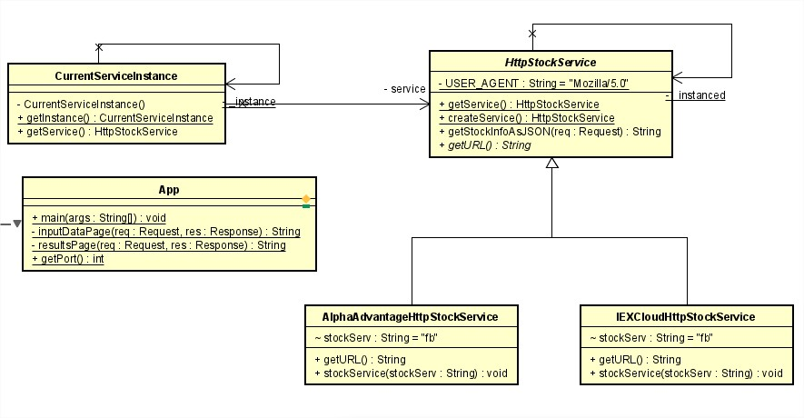

## TAREA INTRODUCCIÓN MVN-GITY HEROKU

### Autor
> Miguel Angel Rodriguez Siachoque
> 24 de Agosto del 2021

### Descripcion
Es una App para 

### Heroku

### Requisitos
- Java
- JUnit
- Maven
- Git
- Heroku
- HTTP

### Diagrama de clases

### JavaDoc:
[JavaDoc - App](JavaDoc/index.html)